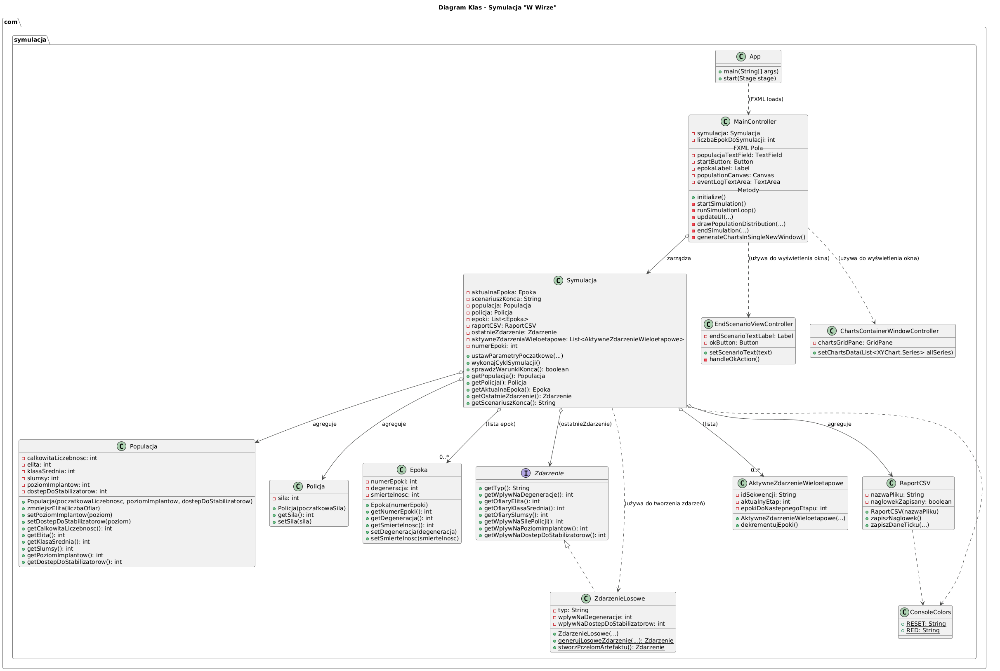
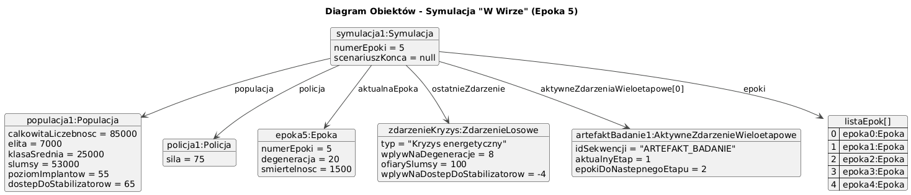
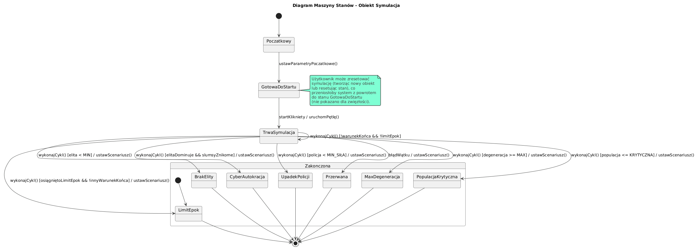

# Dokumentacja Projektu: Symulacja "W Wirze"

## a) Temat projektu

Symulacja "W Wirze": Upadek Społeczeństwa Cyber.
Projekt jest symulatorem społeczeństwa w cyberpunkowym świecie, modelującym jego ewolucję przez kolejne epoki pod wpływem różnych parametrów, zdarzeń losowych i wewnętrznych dynamik społecznych, prowadzących do różnych scenariuszy końcowych.

## b) Skład grupy projektowej z wyszczególnieniem lidera

* **Lider Projektu:** `Wiktoria Bala`
* **Członkowie Grupy:**
    * `Wiktoria Bala`
    * `Filip Banasiak`

## c) Opis zadania symulacji w języku naturalnym

Zadaniem symulacji jest modelowanie dynamiki społeczeństwa w dystopijnym, cyberpunkowym świecie. Użytkownik na początku definiuje parametry startowe, takie jak całkowita liczebność populacji, procentowy podział na klasy społeczne (Elita, Klasa Średnia, Slumsy), początkowy poziom technologicznego zaawansowania (poziom implantów), dostęp do środków łagodzących negatywne skutki życia (dostęp do stabilizatorów) oraz siłę organów porządkowych (siła policji). Określa również liczbę epok, przez które symulacja ma przebiegać.

W każdej epoce symulacja oblicza zmiany w społeczeństwie. Występują zdarzenia losowe (np. pandemie, kryzysy energetyczne, odkrycia technologiczne, bunty, programy socjalne) oraz zdarzenia wieloetapowe (np. badanie artefaktu), które mają określony wpływ na parametry takie jak poziom degeneracji społeczeństwa, śmiertelność w poszczególnych klasach, siłę policji, poziom implantów i dostęp do stabilizatorów. Dodatkowo, wewnętrzne mechanizmy, takie jak korupcja w przerośniętej elicie, również wpływają na populację.

Symulacja śledzi ogólny poziom degeneracji społeczeństwa, który rośnie z czasem i pod wpływem negatywnych zdarzeń, ale może być częściowo redukowany przez siłę policji. Stan populacji, w tym jej liczebność i podział na klasy, jest dynamicznie aktualizowany.

Symulacja może zakończyć się na kilka sposobów:
* Osiągnięcie maksymalnego, krytycznego poziomu degeneracji.
* Spadek całkowitej populacji poniżej progu krytycznego.
* Całkowite zniszczenie Elity.
* Dominacja Elity i marginalizacja pozostałych klas, prowadząca do powstania Cyber-Autokracji.
* Upadek sił policyjnych i anarchia.
* Osiągnięcie zdefiniowanej przez użytkownika liczby epok (zakończenie naturalne).

Wyniki każdej epoki są logowane, a po zakończeniu symulacji generowany jest raport końcowy oraz wykresy przedstawiające zmiany kluczowych parametrów (całkowita populacja, poziom degeneracji, siła policji) w czasie. Interfejs graficzny użytkownika (GUI) pozwala na wprowadzanie parametrów, uruchamianie symulacji, obserwowanie jej postępów w czasie rzeczywistym oraz przeglądanie wyników.

## d) Diagram klas

## e) Diagram obiektów

Przykład diagramu obiektów przedstawiający stan systemu w trakcie symulacji (np. w 5. epoce):

## f) Diagram sekwencji

### Scenariusz 1: Rozpoczęcie i przebieg jednej epoki symulacji (uproszczony)

### Scenariusz 2: Zakończenie symulacji i wyświetlenie wyników (uproszczony)

## g) Diagram maszyny stanów

### Diagram maszyny stanów dla obiektu `Symulacja`

## h) Dokumentacja wygenerowana na podstawie komentarzy w kodzie (JavaDoc)

Pełna dokumentacja API została wygenerowana z komentarzy Javadoc w kodzie.

[Pobierz dokumentację Javadoc (plik .zip)](JavaDoc.zip)

---
# Dokumentacja dodatkowa

## Tabela zawierająca sugestie danych początkowych

Poniższa tabela zawiera sugestie, jakie wartości początkowe mogą pomóc w osiągnięciu konkretnego scenariusza końca. Wyniki mogą się różnić z powodu losowości zdarzeń.

| Scenariusz Końca                                | Sugerowane Wartości Początkowe                                                                                                                               | Uzasadnienie                                                                                                                                                                                                                                                                                                                                                                                      |
| :---------------------------------------------- | :----------------------------------------------------------------------------------------------------------------------------------------------------------- | :------------------------------------------------------------------------------------------------------------------------------------------------------------------------------------------------------------------------------------------------------------------------------------------------------------------------------------------------------------------------------------------------ |
| **Upadek cywilizacji (Max Degeneracja)** | Wysoki początkowy `% implantów` (np. 70-90%), Niski początkowy `% stabilizatorów` (np. 10-30%), Niska `Siła policji` (np. 20-40%), Średnia/wysoka `Populacja` | Wysoki poziom implantów przy niskim dostępie do stabilizatorów może generować specjalne negatywne zdarzenia ("Niepokoje związane z implantami"). Niska siła policji oznacza mniejszą redukcję rosnącej degeneracji.                                                                                                                                                                             |
| **Zagłada (Populacja poniżej progu)** | Bardzo niska `Siła policji` (np. 0-20%), Niska `Populacja początkowa` (np. 10000-20000), Niski `% stabilizatorów` (0-20%), Średni/wysoki `% implantów` (np. 50-70%) | Niska siła policji i mało stabilizatorów oznaczają większą śmiertelność w wyniku zdarzeń. Rozpoczynanie z małą populacją sprawia, że szybciej osiągnie się próg krytyczny.                                                                                                                                                                                                                        |
| **Brak przywództwa (Elita zniszczona)** | Bardzo niski `% elity` (np. 1-5%), Niska `Siła policji` (np. 10-30%), Wysoka podatność na negatywne zdarzenia dotykające elitę. | Mała początkowa liczba elity sprawia, że jest ona bardziej podatna na całkowite wyniszczenie przez zdarzenia losowe. Niska siła policji może prowadzić do zdarzeń, które nieproporcjonalnie dotykają elitę. |
| **Cyber-Autokracja (Dominacja Elity)** | Bardzo wysoki `% elity` (np. 70-80%), Wysoki `% klasy średniej` (np. 15-25%), Wysoka `Siła policji` (np. 70-90%), Wysoki `% stabilizatorów` i `% implantów`. | Silna elita i klasa średnia od początku, przy minimalnych slumsach. Wysoka siła policji i zasoby chronią dominujące klasy. Należy zbalansować z mechanizmem korupcji. |
| **Anarchia (Upadek sił policyjnych)** | Bardzo niska początkowa `Siła policji` (np. 10-20%), Niska ogólna stabilność (niski % stabilizatorów, wysoki % implantów). | Rozpoczynanie z niską siłą policji czyni ją podatną na spadek poniżej 10% w wyniku negatywnych zdarzeń.                                                                                                                                                                                                                                                                            |
| **Zakończenie naturalne (Limit epok)** | Ustawienia zbalansowane: Średnia `Populacja`, Średni podział klas, Średnia/wysoka `Siła policji` (np. 50-70%), Średni/wysoki `% stabilizatorów` i `% implantów`. Duża `Liczba epok`. | Parametry, które pozwalają społeczeństwu przetrwać dłużej bez wpadania w skrajne scenariusze. Celem jest dotrwanie do końca zdefiniowanej liczby epok.                                                                                                                                                                                                                                            |

---
## Linki do stron, które były pomocne w stworzeniu naszej symulacji

### Zasoby dotyczące JavaFX i GUI
* [Oficjalna dokumentacja OpenJFX (openjfx.io)](https://openjfx.io/openjfx-docs/)
* [Using FXML to Create a User Interface (Oracle Help Center)](https://docs.oracle.com/javafx/2/get_started/fxml_tutorial.htm)
* [FXML tutorial (javafx.pl)](https://javafx.pl/fxml-tutorial-1-wprowadzenie/)

### Operacje na plikach i konsoli w Javie
* [How to Write to a CSV File in Java (Baeldung)](https://www.baeldung.com/java-csv)
* [ANSI Escape Codes - GitHub Gist (fnky)](https://gist.github.com/fnky/458719343aabd01cfb17a3a4f7296797)

### Dodatkowe Zasoby (Koncepcje Podstawowe i Narzędzia)
* [Polimorfizm w Javie (Baeldung)](https://www.baeldung.com/java-polymorphism)
* [Kompozycja vs Dziedziczenie (DigitalOcean)](https://www.digitalocean.com/community/tutorials/composition-vs-inheritance-in-java)
* [Java Collections Framework (Oracle)](https://docs.oracle.com/javase/tutorial/collections/index.html)
* [Wielowątkowość w Javie (Baeldung)](https://www.baeldung.com/java-concurrency)
* [Przewodnik po JUnit 5 (Baeldung)](https://www.baeldung.com/junit-5)
* [Budowanie projektu Java z Maven (Oficjalny tutorial)](https://maven.apache.org/guides/getting-started/maven-in-five-minutes.html)

### Zaawansowane Koncepcje i Dobre Praktyki
* [Wprowadzenie do zasad S.O.L.I.D. (Baeldung)](https://www.baeldung.com/solid-principles)
* [Przewodnik po podstawach Git (Atlassian)](https://www.atlassian.com/git/tutorials/what-is-git)
* [Wzorce projektowe (TutorialsPoint)](https://www.tutorialspoint.com/design_pattern/index.htm)
* [Przewodnik po Java Stream API (Baeldung)](https://www.baeldung.com/java-8-streams-introduction)
* [Obsługa wyjątków w Javie (GeeksforGeeks)](https://www.geeksforgeeks.org/exceptions-in-java/)
